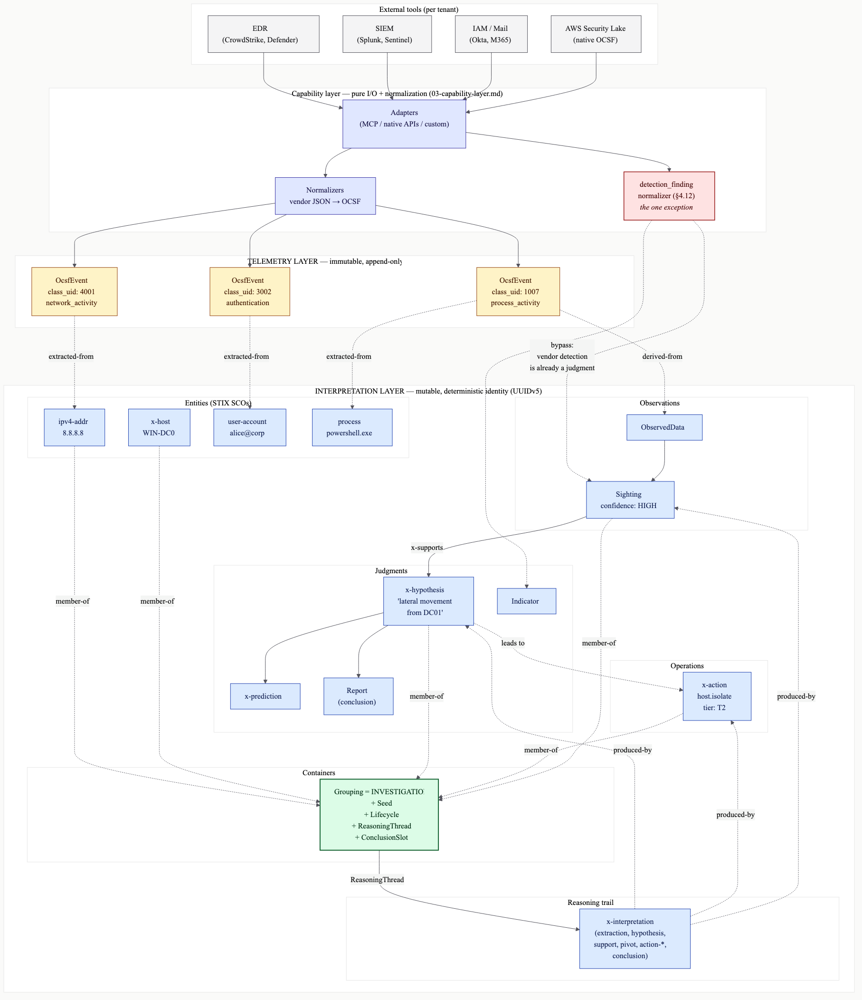

INVESTIGATION DOMAIN MODEL - SPEC FOR FAN-IN
=============================================

PROJECT CONTEXT
---------------
  Product         "Cursor for SOC analysts" — an AI-native investigation
                  environment for threat hunters and IR responders.

  Substrate       VS Code extension (primary), CLI (secondary), Java backend,
                  Next.js frontend for collaboration views, and a transport-
                  neutral capability layer for tool federation (adapters:
                  MCP, native vendor APIs, custom integrations; see
                  03-capability-layer.md §5.4).

  Personas v0     Threat hunters and IR responders — hypothesis-driven,
                  code-comfortable, latency-sensitive. Not T1/T2 triage.

  Workflows v0    Investigation (entity-rooted) and hunting (hypothesis-
                  rooted). Same loop, different entry points.

  Philosophy      Skeleton, not closed product. AI absorbs the fragmentation
                  tax so every analyst operates with T3-level context.

  v0 prototype    All adapters served by OCSF fixtures (see
                  03-capability-layer.md §9), not real tenants.


MENTAL MODEL (start here)
-------------------------



*Source: [diagrams/two-layer-graph.mmd](diagrams/two-layer-graph.mmd) (Mermaid). Re-render with `npx -y @mermaid-js/mermaid-cli -i design/diagrams/two-layer-graph.mmd -o design/diagrams/two-layer-graph.png -b "#fafaf9" -w 2400` (solid background so connection lines and edge labels remain readable on any viewer theme).*

The system is built around a **single tenant-wide graph with two layers**, joined by typed edges. An **investigation** is a *selection* within this graph, **not a graph of its own** — two investigations in the same tenant share entities by construction (the same `8.8.8.8` is the same node everywhere).

  Telemetry        Raw OCSF events as ingested. Immutable. One row per
                   record returned by any tool (SIEM alert, EDR query
                   response, log line). The audit anchor and the substrate
                   from which interpretation is derived.
  Interpretation   STIX-shaped objects holding the analytical state of the
                   tenant. Mutable. Cross-tool identity via deterministic
                   UUIDv5, so the same value reported by two different tools
                   resolves to one node.

What lives in the interpretation layer:

  Entities         SCOs — ip, domain, file, process, host, user-account, ...
  Observations     ObservedData, Sighting — "we saw this, here, this often"
  Judgments        x-hypothesis, x-prediction, Indicator, Report — what we
                   think
  Operations       x-action — state-changing things we did (isolate host,
                   purge email)
  Reasoning acts   x-interpretation — the audit trail of analytical moves
                   (extraction, hypothesis, support/refute, pivot, conclude,
                   action-*)
  Containers       Grouping — the investigation itself, with its Seed,
                   Lifecycle, ReasoningThread, and ConclusionSlot extensions

Cross-layer edges. `extracted-from` (Entity → OcsfEvent), `derived-from`
(ObservedData → OcsfEvent), and a `provenance.raw_record_ref` back-pointer
on most interpretation-layer nodes. Every interpretation-layer node is
traceable to the telemetry that grounds it.

Why split the layers. Facts and judgments have different lifecycles.
Telemetry is immutable and per-event so the audit trail is unforgeable and
re-derivation is always possible. Interpretation is supersedable so a wrong
hypothesis can be revised without erasing its history. Collapsing the
layers loses re-derivability one way (STIX-only) or the ability to
represent branching reasoning the other (OCSF-only).

Where OCSF events come from. Most security tools do not natively emit OCSF.
Capability-layer adapters (03-capability-layer.md §4) call vendor APIs and
normalize each response into OCSF at ingest; the original vendor payload is
retained verbatim on OcsfEvent.payload so re-normalization with updated
rules is always possible. A few sources (AWS Security Lake, recent Splunk)
emit OCSF natively — the adapter is a near-passthrough there.

The detection-finding exception. Vendor-emitted detections (EDR alerts,
SIEM correlations) are already interpretive — pretending otherwise and
re-deriving them would lose fidelity. The `detection_finding` normalizer
(03-capability-layer.md §4.12) is the one place the capability layer
produces interpretation-layer nodes directly (Sightings, Indicators), still
linked back to the originating OcsfEvent. Every other capability output
lands as telemetry first.

What an investigation is, in one paragraph. A STIX Grouping that points at
a working set of interpretation-layer nodes plus an ordered thread of
Interpretation nodes recording each analytical move. The capability layer
produces telemetry and the SCOs/ObservedData directly derived from it
(`derivation_mode = DIRECT`). The agent loop and the analyst produce
everything else (`derivation_mode = INFERRED`).


THREAD SCOPE
------------

This thread defines the **domain model only** — what an investigation IS as a primitive.

**Out of scope** (separate threads):

- Persistence (02-persistence.md)
- Query model
- API surface
- Ingestion pipeline
- Action authorization (04-action-authorization.md)
- Component architecture (05-component-architecture.md)
- Capability layer (03-capability-layer.md)
- UI projections


DECISIONS RULED OUT (do not re-litigate)
----------------------------------------

- **Notebook-cells as the underlying model** — fine as a view, fights how investigations branch.
- **Hand-rolling entity types** instead of adopting STIX SCOs.
- **Embedding OCSF inside STIX** as a nested payload.
- **Embedding STIX inside OCSF**.
- **Investigation = reasoning** — an investigation *contains* reasoning, doesn't equal it.
- **A constrained bottom layer** that enforces acyclicity or rigid kinds.
- **A pure hierarchy** with one privileged containment axis.


ARCHITECTURAL COMMITMENTS
-------------------------

**1. Two-layer graph.** Telemetry layer holds raw OCSF events as ingested via capability-layer adapters (03-capability-layer.md §4) — natively where the source supports OCSF, normalized at ingest where it doesn't — stored verbatim, immutable. Interpretation layer holds STIX-shaped objects representing entities, observations, judgments, and reasoning, all mutable. The two layers are joined by typed edges, not embedding. One OCSF event can back many STIX nodes. One STIX entity can be backed by many OCSF events. See "Mental model" above for the rationale.

**2. Vocabularies.** STIX 2.1 is the vocabulary for the interpretation layer. OCSF is the vocabulary for telemetry payloads.

**3. Deterministic identity.** Identity follows STIX deterministic UUIDv5 rules, computed within a per-tenant namespace UUID (see below). The same entity (e.g., `8.8.8.8`) produces the same ID across producers and investigations within a tenant. Cross-investigation entity identity is preserved by default within a tenant. Aliasing between entities is an **explicit edge, never a destructive merge**.

**4. Three deliberate STIX deviations.** Identity computation deviates from strict STIX 2.1 for three SCO types — `process`, `email-addr`, `user-account` — required for cross-tool stitching to work in real enterprise environments where every authentication system, mail platform, and EDR is case-insensitive in practice. See 03-capability-layer.md §7.2 for the per-type rules and rationale.

**5. Multi-tenant by construction.** A tenant is a complete partition of the data:

- its own STIX object store
- its own event stream
- its own user / RBAC scope
- its own adapter configuration
- its own investigations
- its own namespace UUID for identity computation

The same value (e.g., `8.8.8.8`) in two different tenants produces two different STIX ids — **cross-tenant identity collision is impossible by construction**, not just by access control. STIX patterns (used by Indicator SDOs) operate on field values rather than ids, so explicit cross-tenant indicator sharing remains possible if and when a federated indicator pool is introduced (deferred; not v0). The tenant namespace UUID is assigned at tenant creation (a fresh UUIDv4) and immutable thereafter; changing it would re-id every node in the tenant. STIX is the *vocabulary* for the interpretation layer here, not the *wire format* — the per-tenant-namespace deviation is a deliberate trade in service of multi-tenant isolation, and STIX-conformant ids can be reconstructed at export boundaries if external federation is ever needed.

**6. Investigation = Grouping + four extensions.** An investigation is a STIX Grouping plus **Seed**, **Lifecycle**, **ReasoningThread**, **ConclusionSlot**. Defined in detail in the *Investigation* section below.

**7. Two genuinely invented primitives.**

- **Interpretation** — records reasoning acts: who, when, from-what, to-what, why.
- **x-action** — state-changing operations against the world (see 04-action-authorization.md).

Hypotheses and predictions are *not* separate primitives — they are outputs of Interpretations and live as STIX-shaped nodes inside the Grouping.

**8. No bottom-layer constraints.** Bottom-layer primitives are *node*, *edge*, *payload*. No constraints enforced at the core. Conventions validated at consumer boundaries (ingress, API egress, AI tool calls, persistence write paths).


TELEMETRY LAYER
---------------

The single primitive at this layer is **`OcsfEvent`** — immutable once written.

```
OcsfEvent (immutable)

  id              UUID, system-assigned
  class_uid       int, OCSF class identifier
                  (e.g., 1007 process_activity, 3002 authentication)
  class_name      string, OCSF class name
  time            timestamp, when event occurred in the world
  recorded_at     timestamp, when ingested
  source_tool     string, source adapter identifier
                  (e.g., "crowdstrike_falcon", "splunk_es",
                  "fixture:<scenario>"); see 03-capability-layer.md §5.4
  payload         object, full original OCSF payload, untouched
```

The v0 set of OCSF classes ingested is out of scope here; it depends on the capability layer (03-capability-layer.md §4).


INTERPRETATION LAYER
--------------------

All objects follow **STIX 2.1 conventions**. Identity is `<type>--<uuidv5>`. Common fields (`created`, `modified`, `created_by_ref`) follow STIX semantics throughout.

### Entity (STIX SCO)

**v0 types:**

- **STIX-native:** `ipv4-addr`, `ipv6-addr`, `domain-name`, `url`, `file`, `directory`, `network-traffic`, `email-addr`, `email-message`, `user-account`, `process`
- **Custom (`x-` prefix):** `x-host`, `x-registry-key`, `x-scheduled-task`, `x-group`

The four `x-` types cover Windows registry keys, scheduled tasks (and equivalents — cron, launchd, systemd), directory groups (AD / Entra / Okta), and host entities, which STIX 2.1 does not cover natively.

Canonical identifiers are normalized on construction. Identity rules (including the three case-insensitivity deviations noted in *Architectural Commitments §4*) live in 03-capability-layer.md §7.2.

### ObservedData (STIX SDO)

```
ObservedData

  id                  observed-data--<uuid>
  first_observed      timestamp
  last_observed       timestamp
  number_observed     int
  object_refs         list of entity ids
  created, modified, created_by_ref (STIX standard)
```

Linked to `OcsfEvent`(s) via the `derived-from` edge.

### Sighting (STIX SRO)

```
Sighting

  id                    sighting--<uuid>
  sighting_of_ref       STIX object id (what was sighted)
  observed_data_refs    list (the evidence)
  first_seen            timestamp
  last_seen             timestamp
  count                 int
  confidence            HIGH | MEDIUM | LOW
  description           string (rationale)
  created, modified, created_by_ref (STIX standard)
```

### Adopted unchanged from STIX 2.1

**Indicator**, **Report**, **Note**, **Opinion** — used as-is.

### Relationship (STIX SRO)

Generic typed edge between any two STIX objects. Fields per STIX standard plus provenance.


INVESTIGATION
-------------

An **investigation** is a STIX Grouping plus four extensions:

1. **Seed** — what kicked it off (immutable, set at creation).
2. **Lifecycle** — where it sits in its workflow (state machine).
3. **ReasoningThread** — the ordered audit trail of analytical moves.
4. **ConclusionSlot** — the final Report, once concluded.

### Grouping (substrate)

```
id              grouping--<uuid>
name            string
description     string
context         "investigation" or "hunt"
object_refs     list of STIX object ids (members). Mutable: members are
                added and (soft-)removed over an investigation's life via
                MemberAdded / MemberRemoved events (02-persistence.md §3).
                Soft removal preserves history — the change lives in the
                event stream, not as a destructive edit to object_refs.
created, modified, created_by_ref (STIX standard)
```

### Extension 1 — Seed

Immutable, set at creation. One of three shapes:

- **AlertSeed** — `alert_id`, `source`, optional `detection_finding_ref`
- **EntitySeed** — `entity_ref` (STIX SCO id)
- **QuestionSeed** — `hypothesis_statement` (string)

### Extension 2 — Lifecycle

A status state machine.

**States:** `DRAFT`, `ACTIVE`, `PAUSED`, `CONCLUDED`, `ARCHIVED`.

**Transitions:**

```
DRAFT      →  ACTIVE
ACTIVE     ↔  PAUSED
ACTIVE     →  CONCLUDED
CONCLUDED  →  ACTIVE       (reopen)
CONCLUDED  →  ARCHIVED
```

**Invariants:**

- `CONCLUDED` requires `conclusion_ref` populated.
- **Reopen** (`CONCLUDED → ACTIVE`) clears `conclusion_ref`; the prior Report is preserved and referenced from the reasoning thread.
- Each transition emits an Interpretation of type `lifecycle`. The lifecycle event and the Interpretation are written in the **same aggregate transaction** (02-persistence.md §3) with a shared `correlation_id`.
- `CONCLUDED` accepts new Interpretations **only** when they are (a) `action-*` lifecycle entries for **reversal actions** (see 04-action-authorization.md §9.1 — un-isolating a host weeks after closing the case without reopening), (b) `post_conclusion` entries from the post-conclusion pipeline (07-post-conclusion-outputs.md §9), or (c) `linkage` entries recording cross-investigation relationships discovered after closure. `conclusion_ref` stays set; the reasoning thread continues to grow with the reversal / post-conclusion / linkage trace; the investigation does **NOT** auto-reopen. Any other Interpretation against a `CONCLUDED` investigation requires an explicit reopen.
- `ARCHIVED` accepts **no new events of any kind**.

### Extension 3 — ReasoningThread

Ordered list of Interpretation node references. **Empty thread is valid** (e.g., a freshly-created DRAFT investigation).

### Extension 4 — ConclusionSlot

Nullable reference to a STIX Report object. Populated only on transition into `CONCLUDED`; cleared on reopen.


INTERPRETATION (records a reasoning act)
----------------------------------------

Records a **single reasoning act**: who, when, from-what, to-what, why.

### Reference types

Used below and on `x-action`:

```
EvidenceRef = StixId | OcsfEventId
```

A typed union — a reference to either a STIX object or a raw `OcsfEvent`. `Interpretation.input_refs` and `x-action.evidence_refs` are both `list<EvidenceRef>`. **Output references are always `StixId`** — Interpretations produce STIX-shaped nodes only, never OcsfEvents.

### Schema

```
x-interpretation

  id                                x-interpretation--<uuid>
  actor                             ActorRef (canonical shape; see "Actor model" below)
  timestamp                         timestamp
  interpretation_type               enum (see "Interpretation types" below)
  input_refs                        list<EvidenceRef> — node ids reasoned over
  output_refs                       list<StixId> — STIX nodes produced
  rationale                         string, bounded ~500 chars (see note below)
  confidence                        optional HIGH | MEDIUM | LOW
  consulted_sops                    optional list<{sop_id, version,
                                    retrieval_score, used: bool}> — SOPs
                                    surfaced by knowledge-service retrieval;
                                    `used` distinguishes cited from merely
                                    retrieved. See 06-knowledge-service.md §6.
  consulted_similar_investigations  optional list<{summary_id, version,
                                    retrieval_score, used: bool}> —
                                    concluded-investigation summaries
                                    surfaced by similarity retrieval. See
                                    06-knowledge-service.md §6.
```

`rationale` is **terse by design**. Full transcript / tool-call detail lives in side stores per 02-persistence.md §6 Layer B and is referenced from the Interpretation, not embedded.

### Actor model (canonical across the system)

```
actor.principal    { user_id, display_name } — always a human
actor.delegate     optional { agent_id, agent_kind, model } — the AI
                   agent if any. agent_kind distinguishes our own agents
                   from vendor agents and other delegates.
actor.kind         derived: HUMAN if delegate is null, else AI_DELEGATED
```

**AI is always a delegate, never a standalone principal.** Every Interpretation (and every persisted event — see 02-persistence.md §7) records a human principal, even when the reasoning was performed by an AI agent or imported from an external system.

- The **principal** is who is *responsible* for the act.
- The **delegate** is who/what *performed* it.
- Authorization derives from principal permissions; the delegate may be restricted further but never broader.

**Scope.** The canonical `ActorRef` shape applies only to **invented primitives** (`x-interpretation`, `x-action`) and to the **persistence event envelope** (see 02-persistence.md §7). STIX SDOs / SROs / SCOs (ObservedData, Sighting, Indicator, Report, Note, Opinion, Relationship, x-hypothesis, x-prediction, all SCOs) use the STIX-standard `created_by_ref` → Identity ref convention as defined by STIX 2.1. The responsibility chain for any STIX-shaped node runs through the Interpretation that produced it, *not* through that node's own `created_by_ref`.

### Interpretation types (canonical enum)

Referenced by all components.

| Type              | Meaning                                                                                                                              |
| ----------------- | ------------------------------------------------------------------------------------------------------------------------------------ |
| `extraction`      | Entity lifted from an OcsfEvent.                                                                                                     |
| `sighting`        | Sighting created from ObservedData.                                                                                                  |
| `hypothesis`      | `x-hypothesis` proposed (creation; includes AI-PROPOSED → OPEN acknowledgment and non-status field updates).                         |
| `support`         | `x-hypothesis` status changed to SUPPORTED.                                                                                          |
| `refutation`      | `x-hypothesis` status changed to REFUTED.                                                                                            |
| `inconclusive`    | `x-hypothesis` status changed to INCONCLUSIVE or ABANDONED (rationale carries the distinction).                                      |
| `prediction`      | `x-prediction` proposed.                                                                                                             |
| `conclusion`      | Investigation concluded; final Report referenced from `ConclusionSlot`.                                                              |
| `pivot`           | Reasoning departed from one entity to pursue a related lead. Underlying telemetry queries are T0; this captures the analytical move. |
| `lifecycle`       | Investigation state transition (DRAFT / ACTIVE / PAUSED / CONCLUDED / ARCHIVED).                                                     |
| `action-request`  | `x-action` proposed (see 04-action-authorization.md §3.2 for the full action lifecycle).                                             |
| `action-approval` | `x-action` approved (manual, auto-policy, or two-party primary).                                                                     |
| `action-rejection`| `x-action` denied.                                                                                                                   |
| `action-expiry`   | `x-action` timed out unapproved (system-emitted).                                                                                    |
| `action-dispatch` | `x-action` sent to its capability adapter (system-emitted).                                                                          |
| `action-result`   | `x-action` terminal outcome — SUCCEEDED, FAILED, PARTIAL, TIMEOUT (system-emitted).                                                  |
| `action-reversal` | A previously-SUCCEEDED `x-action` was reversed by a new `x-action`.                                                                  |
| `linkage`         | Investigation linked to another (see-also, follow-up-of, spawned-by, duplicate-of, supersedes); see 07-post-conclusion-outputs.md §5. |
| `post_conclusion` | Step in the post-conclusion pipeline (archive, IOC extract, candidate-SOP, linkage suggestion, ticketing handoff); see 07.            |
| `other`           | Escape hatch. `rationale` MUST be populated. Periodic review drives new typed values when patterns emerge.                            |

### Interpretation lifecycle and correction

- **Append-only by default.** An Interpretation, once recorded, is the immutable record of one reasoning act.
- **Supersession (correction)** is supported via the `InterpretationSuperseded` event (02-persistence.md §3): the new Interpretation becomes the current view in the thread, and the superseded one remains visible. There is **no destructive deletion**.


CUSTOM STIX OBJECTS
-------------------

### x-hypothesis

A **working theory under investigation**.

```
x-hypothesis

  id                  x-hypothesis--<uuid>
  statement           string (the claim)
  status              PROPOSED | OPEN | SUPPORTED | REFUTED |
                      INCONCLUSIVE | ABANDONED
  parent_ref          optional x-hypothesis id (refinement)
  rooted_at_ref       optional STIX SCO id (anchor entity)
  rationale           string (why proposed)
  labels              optional list of strings — MITRE ATT&CK technique
                      IDs by convention (e.g., "T1486", "T1078.004");
                      freeform values permitted
  created, modified, created_by_ref (STIX standard)
```

**Notes:**

- `PROPOSED` is the initial state for **AI-generated** hypotheses pending acknowledgment.
- `OPEN` is the initial state for **analyst-created** hypotheses, and where AI hypotheses move on acknowledgment.
- **Evidence is not embedded** — it lives as `x-supports` / `x-refutes` relationships from Sightings.
- Status transitions are recorded as Interpretations in the reasoning thread.

### x-prediction

A **testable consequence** of a hypothesis.

```
x-prediction

  id                  x-prediction--<uuid>
  hypothesis_ref      x-hypothesis id
  statement           string (what would be observed if hypothesis is true)
  test_query          optional QuerySpec { tool, query_text, parameters }
  status              UNTESTED | CONFIRMED | DISCONFIRMED | INCONCLUSIVE
  test_result_refs    list of ObservedData or Sighting ids
  created, modified, created_by_ref (STIX standard)
```

### x-action

A **state-changing operation against the world** (host isolation, email purge, detection deployment, etc.). Canonical schema:

```
x-action

  id                  x-action--<uuid>
  action_type         string (controlled vocabulary, e.g.,
                      "host.isolate", "email.purge", "detection.deploy")
  tier                T2 | T3
  status              REQUESTED | PENDING_SECONDARY | APPROVED |
                      EXECUTING | SUCCEEDED | FAILED | REJECTED |
                      EXPIRED | REVERSED
  targets             list<TargetSpec>
                      (TargetSpec = { entity_ref: StixId,
                                      resolved_identifier: string,
                                      asset_criticality?: string };
                       full def in 04-action-authorization.md §3.1)
  parameters          object (action-specific arguments)
  requested_by_actor  ActorRef
  requested_at        timestamp
  rationale           string, bounded ~500 chars
  evidence_refs       list<EvidenceRef>
  investigation_ref   grouping--<uuid>
  reversal_of_ref     optional x-action id (if this reverses another)
  reversed_by_ref     optional x-action id (set when this is reversed)
  expires_at          timestamp (REQUESTED expires if not approved
                      by this time; system emits ActionExpired)
  assignee_ref        optional Analyst id (claimed by reviewer)
  pending_approvers   optional set<Analyst id>
  authorization       Authorization sub-record
                      (04-action-authorization.md §3.3)
  execution           Execution sub-record
                      (04-action-authorization.md §6.1)
  created, modified, created_by_ref (STIX standard)
```

**Field notes:**

- `PENDING_SECONDARY` is used **only** under TWO_PARTY authorization: the action sits in this state between primary and secondary approval. See 04-action-authorization.md §3.2.
- `parameters` shape is determined per `action_type` by the capability adapter contract.
- `evidence_refs` **must equal** the producing Interpretation's `input_refs`. Same-aggregate transaction guarantees this (02-persistence.md §3 `ActionRequested`), so no separate write-time check.
- `assignee_ref` is set when an analyst opens the review panel and claims the action; **first analyst to approve/reject wins** (04-action-authorization.md §5.4).
- `pending_approvers`: for TWO_PARTY, this is the secondary pool minus the primary approver.

**Conceptual notes:**

- `x-action` is a **sibling primitive** to `x-hypothesis` and `x-prediction` — it has its own lifecycle (the `status` field) rather than being a single recorded act.
- The producing reasoning is captured by an Interpretation of type `action-request`; subsequent state changes produce `action-approval`, `action-rejection`, `action-expiry`, `action-dispatch`, `action-result`, or `action-reversal` Interpretations. See 04-action-authorization.md §3.2 for the full state machine and §3.3 / §6 for the authorization and execution sub-records.


EDGE TYPES (v0 vocabulary, open)
--------------------------------

| Edge             | From           | To             | Meaning                                                                                                                                                |
| ---------------- | -------------- | -------------- | ------------------------------------------------------------------------------------------------------------------------------------------------------ |
| `extracted-from` | Entity         | OcsfEvent      | Entity lifted from telemetry.                                                                                                                          |
| `derived-from`   | ObservedData   | OcsfEvent      | Observation traces to raw event.                                                                                                                       |
| `sighted-in`     | Sighting       | ObservedData   | Sighting based on observation.                                                                                                                         |
| `member-of`      | any STIX node  | Grouping       | Investigation membership.                                                                                                                              |
| `produced-by`    | any STIX node  | Interpretation | Produced by this reasoning act.                                                                                                                        |
| `x-supports`     | Sighting       | x-hypothesis   | Evidence supports (with weight: `STRONG` \| `MODERATE` \| `WEAK`).                                                                                     |
| `x-refutes`      | Sighting       | x-hypothesis   | Evidence refutes (with weight: `STRONG` \| `MODERATE` \| `WEAK`).                                                                                      |
| `aliases`        | Entity         | Entity         | Identity assertion (non-destructive — never a merge).                                                                                                  |
| `parent-of`      | x-hypothesis   | x-hypothesis   | Hypothesis refinement.                                                                                                                                 |
| `reverses`       | x-action       | x-action       | A reversing action negates a previously-`SUCCEEDED` action. Also expressible via `x-action.reversal_of_ref`; the edge form supports graph queries (04-action-authorization.md §7). |

Standard STIX relationship types (`indicates`, `uses`, `targets`, `communicates-with`, `resolves-to`, `located-at`, etc.) are also valid where applicable.


PROVENANCE
----------

Uniform on **ObservedData**, **Sighting**, **Interpretation**, **Relationship**.

```
tool                string (source tool name, "manual", or "ai-inference")
query               optional string
query_run_at        optional timestamp
raw_record_ref      optional OcsfEvent id
derivation_mode     DIRECT (from a tool) | INFERRED (derived/reasoned)
coverage            optional — see below
producer_version    optional string — see below
```

**`coverage` values:** `COMPLETE` | `PARTIAL` | `UNAVAILABLE_TENANT` | `UNAVAILABLE_TRANSIENT` | `FAILED`. See 03-capability-layer.md §6 for definitions.

> Load-bearing for **evidence-of-absence** reasoning: an empty result with `coverage=COMPLETE` means we looked and found nothing; an empty result with any non-COMPLETE means we did not look fully.

**`producer_version`:** version of the producer that emitted this artifact:

- Normalizer version for capability-layer outputs.
- AI agent + model version for reasoning outputs. On Interpretations, extended with an optional `retrieval_context_hash` — a hash over the union of `consulted_sops` and `consulted_similar_investigations` (see x-interpretation schema). Re-running an investigation under the same retrieval context (same SOPs and summaries available at the same versions) yields a stable hash, supporting behavioral-consistency analysis across runs. See 06-knowledge-service.md §6.3.
- Human user-agent for analyst-authored outputs.

Used to scope re-normalization and re-reasoning.


INVARIANTS
----------

**Immutability and ownership**

- `OcsfEvent` is **immutable** after write.
- Every node and event belongs to **exactly one tenant**.
- Identity computation uses the owning tenant's namespace UUID; the namespace is **immutable for the lifetime of the tenant**.

**Identity**

- Entity identity is **deterministic UUIDv5 within a tenant** *when the identity tuple is complete* — same value, same tool inputs, same tenant always produces the same id, stable across investigations.
- When the identity tuple is incomplete or unavailable (e.g., a `process` SCO without a known `created_time`, or opaque `ObservedData` with no canonical content — see 03-capability-layer.md §7.1 *ObservedData rule* and §7.2 *process deviation*), the SCO carries a random UUIDv4 and is **not stitchable** across tools.
- Cross-tenant identity is independent by construction regardless.
- **Aliasing** is non-destructive and is always within a tenant; cross-tenant aliasing is not expressible.

**Investigation lifecycle**

- Investigation **seed is immutable** after creation.
- Investigation cannot be `CONCLUDED` without `conclusion_ref` populated.
- Every status change on `x-hypothesis` produces a corresponding Interpretation in the reasoning thread.
- Every node in an investigation's `object_refs` has a `member-of` edge to that Grouping.

**Reasoning provenance**

- Every interpretation-layer node **produced within this system** has a `produced-by` edge to the Interpretation that created it.
- **Imported nodes** (e.g., vendor-emitted Indicators / Sightings ingested via the capability layer's `detection_finding` normalizer — see 03-capability-layer.md §4.12) carry **no `produced-by` edge**; their upstream attribution lives in `provenance.tool` and STIX-standard `created_by_ref` to a per-tenant vendor Identity SDO. The agent loop creates a system Interpretation only when an investigation engages with the imported node.


ADOPTED VS INVENTED
-------------------

### Adopted unchanged

- **From STIX 2.1** — all SCOs, `ObservedData`, `Sighting`, `Indicator`, `Report`, `Note`, `Opinion`, `Grouping`, `Relationship`, identity rules (deterministic UUIDv5), field naming conventions, custom-object naming convention (`x-` prefix).
- **From OCSF** — event classes and payload shapes, class UID system.
- **From working SOC tooling and IR methodology** (TheHive, NIST 800-61) — case lifecycle state machine, seed concept (precursor / indicator / question).
- **From event-sourcing patterns** — reasoning thread as append-only ordered log.

### Invented

- **`x-interpretation`** — primitive that records a reasoning act.
- **`x-action`** — primitive for state-changing operations. Lifecycle and authorization in 04-action-authorization.md.
- **Custom STIX SDOs:** `x-hypothesis`, `x-prediction`.
- **Custom STIX SCOs:** `x-host`, `x-registry-key`, `x-scheduled-task`, `x-group` — entity types not covered by STIX 2.1 native; identity rules in 03-capability-layer.md §7.2.
- **Custom STIX relationship types:** `x-supports`, `x-refutes`, `reverses`.
- **Investigation extension structure** — `Seed`, `Lifecycle`, `ReasoningThread`, `ConclusionSlot` layered on top of `Grouping`.


OPEN QUESTIONS DELIBERATELY LEFT TO IMPLEMENTATION
--------------------------------------------------

These are **not domain-model gaps**. The model accommodates either choice.

- Sharding / partitioning strategy for per-tenant data at scale. Constrained by the tenant model — per-tenant scope is guaranteed by construction; the remaining question is operational tuning within a tenant, not global federation.

### Closed (resolved by other specs)

- **Eager STIX promotion from OCSF.** Every tool response is normalized at ingest into `ObservedData` and SCOs, with the raw `OcsfEvent` retained as ground truth and re-normalizable on demand. See 03-capability-layer.md §4.13.
- **Reasoning thread is a projection.** It is materialized as a projection (`investigation_thread`) rebuilt from the event stream; the canonical ordering lives in the events' `sequence_no`, not in a list field on the Grouping. The Grouping's `ReasoningThread` extension is the logical view. See 02-persistence.md §4.2.
- **`labels` on `x-hypothesis` controlled vocabulary.** Bind to MITRE ATT&CK technique IDs (e.g., `T1486`, `T1078.004`) by convention; freeform values remain permitted. The agent loop is prompted to label hypotheses with applicable techniques where evident. See 05-component-architecture.md §13.1.


END OF SPEC
